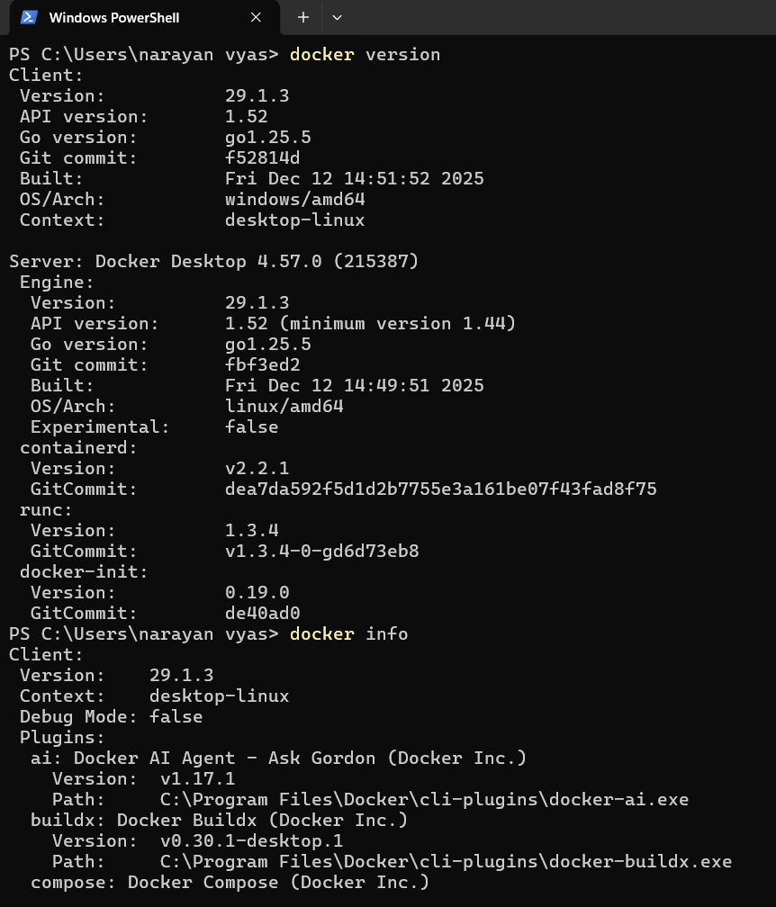
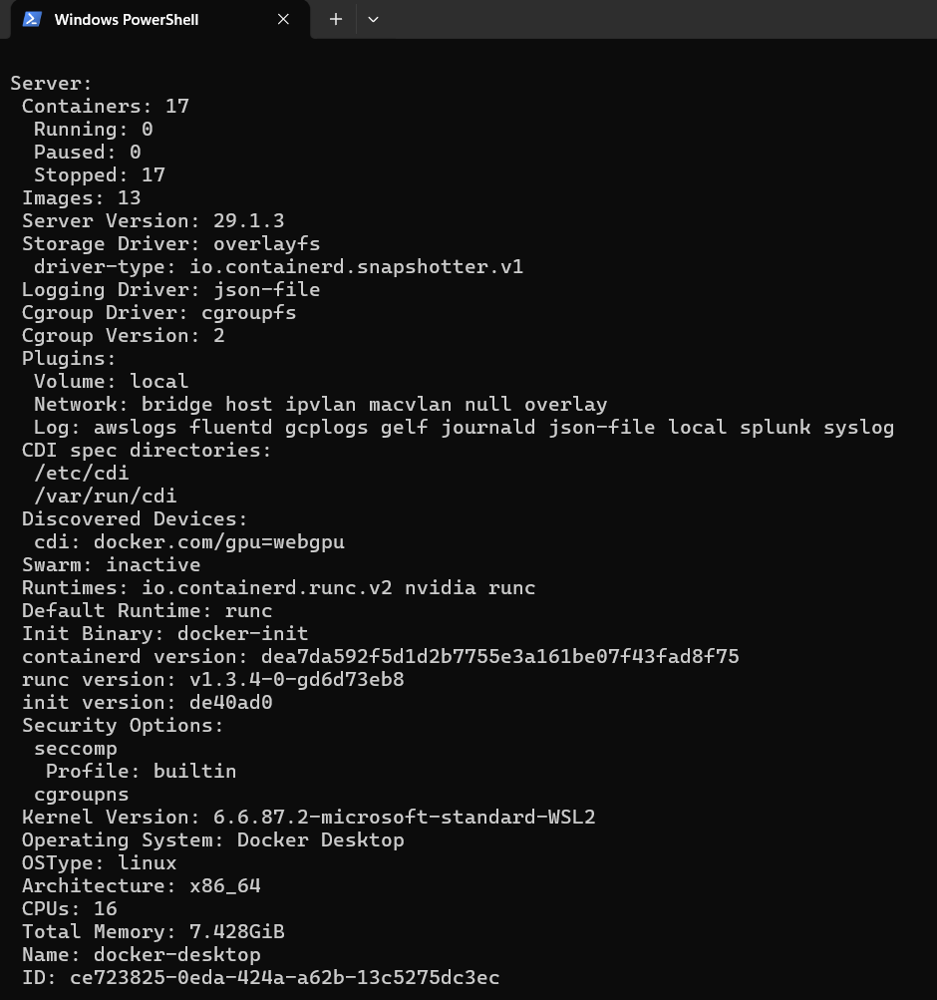
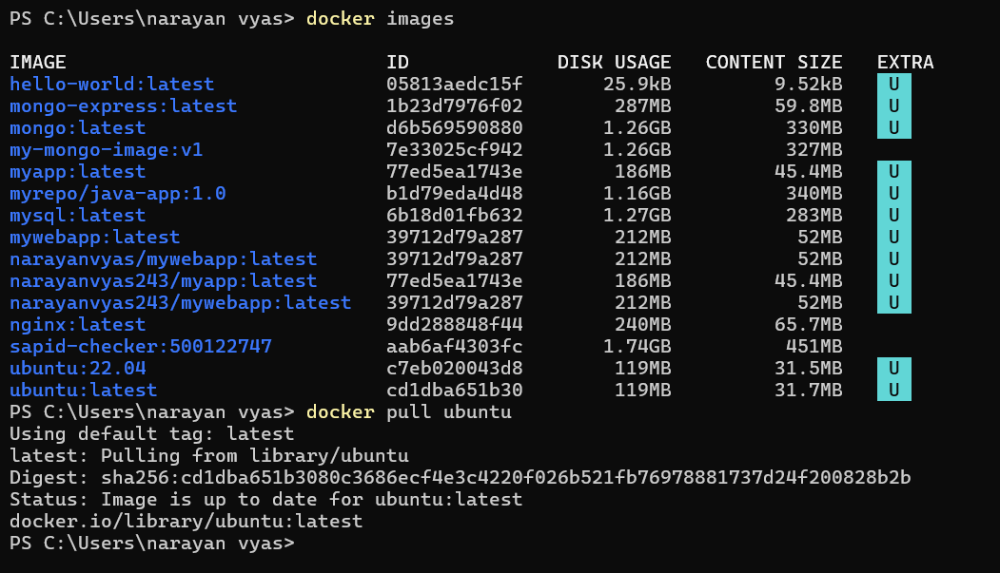
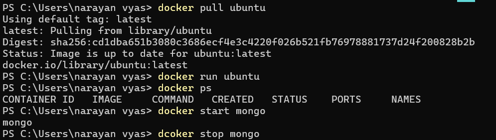
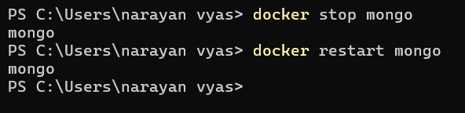
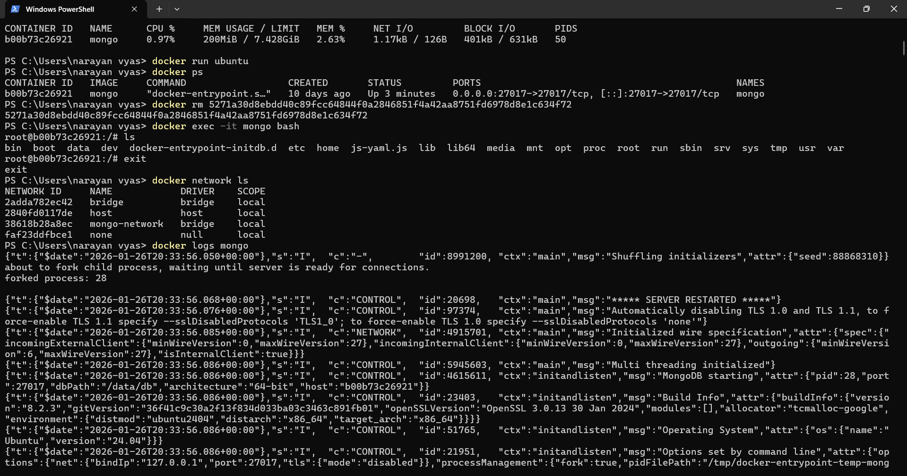

# 🐳 Docker Basic Commands & Flags – Hands On

This unit covers all fundamental Docker commands used in containerization and DevOps.

It includes:
- Image Management
- Container Lifecycle
- Networking
- Volumes
- Logs & Monitoring
- Build Process
- Cleanup
- Docker Compose

---

# 📌 1. Docker Basics

## Check Docker Version
```bash
docker version
```
Shows client and server version and confirms Docker daemon connectivity.

## System Information
```bash
docker info
```
Displays system-wide Docker details like images, containers, drivers, CPU and memory.

---

# 📌 2. Image Management

## List Images
```bash
docker images
```
Flags:
- -a → show all images
- -q → only image IDs

## Pull Image
```bash
docker pull ubuntu
docker pull ubuntu:22.04
```

## Remove Image
```bash
docker rmi ubuntu
```

Flags:
- -f → force removal
- -a → remove unused images

---

# 📌 3. Container Lifecycle

## Run Container
```bash
docker run ubuntu
```

Common flags:
- -it → interactive terminal
- -d → detached mode
- --name → custom name
- --rm → auto remove

Example:
```bash
docker run -it --name test ubuntu bash
```

## List Containers
```bash
docker ps
```

## Start / Stop / Restart
```bash
docker start container_name
docker stop container_name
docker restart container_name
```

## Remove Container
```bash
docker rm container_name
```

---

# 📌 4. Execute Commands Inside Containers

```bash
docker attach container_name
docker exec -it container_name bash
```

Flags:
- -i → interactive
- -t → terminal

---

# 📌 5. Networking & Ports

## Port Mapping
```bash
docker run -d -p 8080:80 nginx
```
Host port 8080 → Container port 80

## List Networks
```bash
docker network ls
```

## Create Network
```bash
docker network create mynet
```

---

# 📌 6. Volumes & Data Persistence

## Create Volume
```bash
docker volume create mydata
```

## Mount Volume
```bash
docker run -v mydata:/data ubuntu
```

Bind mount:
```bash
docker run -v /host/path:/container/path ubuntu
```

Read-only:
```bash
docker run -v mydata:/data:ro ubuntu
```

---

# 📌 7. Logs & Monitoring

## View Logs
```bash
docker logs container_name
```

## Resource Usage
```bash
docker stats
```
Shows CPU, Memory, Network and Disk usage.

---

# 📌 8. Inspect & Metadata

```bash
docker inspect container_name
```
Returns configuration details in JSON format.

---

# 📌 9. Docker Build (Images)

```bash
docker build -t myapp .
```

Example Dockerfile:
```dockerfile
FROM ubuntu:22.04
RUN apt update && apt install -y nginx
CMD ["nginx", "-g", "daemon off;"]
```

---

# 📌 10. Cleanup Commands

```bash
docker container prune
docker image prune
docker system prune -a --volumes
```

---

# 📌 11. Docker Compose

Start services:
```bash
docker compose up -d
```

Stop services:
```bash
docker compose down
```

---

# 📌 12. Important Run Flags

| Flag | Meaning |
|--------|----------------|
| -it | Interactive terminal |
| -d | Detached mode |
| --rm | Auto remove |
| --name | Container name |
| -p | Port mapping |
| -v | Volume mount |
| -e | Environment variable |
| --network | Custom network |

---

# 📌 13. Key Concepts Summary

| Term | Meaning |
|-----------|----------------|
| Image | Blueprint |
| Container | Running instance |
| Volume | Persistent storage |
| Network | Communication |
| Dockerfile | Build instructions |

---

# 📸 Screenshots (Command Outputs)

## Images List


## Containers List


## Container Lifecycle


## Exec / Attach Commands


## Networking


## Volumes


## Monitoring / Stats


---

# ✅ Conclusion

All basic Docker commands were practiced and verified using terminal outputs.  
This forms the foundation of Containerization and DevOps workflows.
